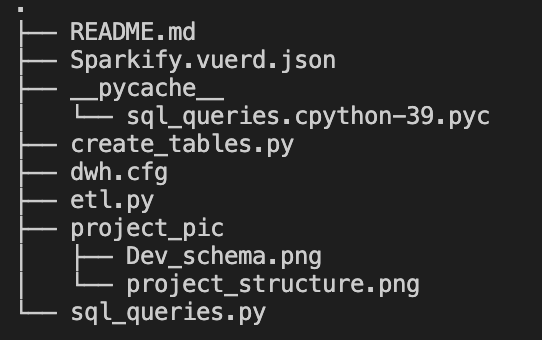

# Data Warehousing:

#### Sparkify start-up company has log file for customer activity, that is resides in Amazon cloud storage S3, in a directory of JSON. The company would like to know which songs thier clients are listening too.

## Objectives

- Build an ETL pipeline by extracting the data from AWS s3 cloud storage into two staging tables.
- Build a star schema in AWS Redshift that has one fact table and four dimension tables.
- Load the data to the star schema by using the AWS copy command from the stanging tables.
- Create Virtual private cloud(VPC) for external access to the schema

## Technohlgy:
* AWS S3
* AWS Redshift
* Python3
* psql

# Star Scheam and ETL pipline

- python3 create_tables.py:
  - Drop tables if its exists
  - Create tables in AWS Redshift.
- python3 etl.py:
  - Copy the data from s3 and loading the data into the staging tables that resides in Redshift.
  - Insert data into the star scheam from staging tables

* ## dwh.cfg
  - Has aws account/cluster/dataset information

# Project Files:

# Schema

# Refrence:

- How to convert epoch to datetime redshift?
  https://stackoverflow.com/questions/39815425/how-to-convert-epoch-to-datetime-redshift

- Redshift DISTKEY / SORTKEY
  https://stackoverflow.com/questions/52885257/redshift-distkey-sortkey

- dataset s3 ex.
  http://udacity-dend.s3.amazonaws.com/song-data/A/B/N/TRABNQK128F14A2178.json
